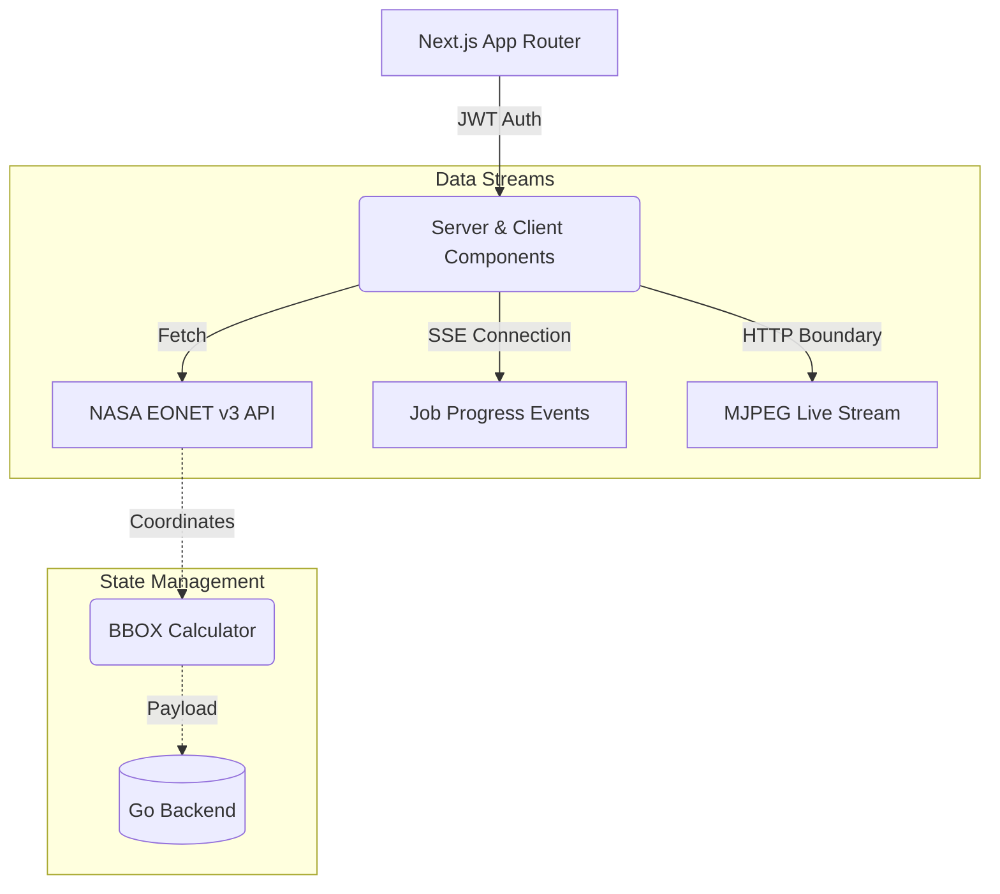

# 🌍 GeoStream — Orbital Intelligence Dashboard

> **Production-grade Next.js 15 interface for real-time satellite tracking and geospatial event monitoring.**

[](https://nextjs.org/)
[](https://www.typescriptlang.org/)
[](https://tailwindcss.com/)
[](LICENSE)
> 🚀 **Live Demo:** [geo.kushan.codes](https://geo.kushan.codes)
> 📡 **Live API:** [api.geo.kushan.codes/health/live](https://api.geo.kushan.codes/health/live)
> 🔗 **Backend repo:** [geostream-orbital-engine](https://github.com/Kushan-shah/geostream-orbital-engine)

---

## 💡 Why This Interface Matters

Building a dashboard for real-time satellite video streams requires bypassing standard REST API limitations. This frontend was engineered to handle continuous byte streams without overwhelming the browser's memory heap or freezing the DOM thread.

- **Non-blocking Media Pipes:** Implements custom `` buffering to natively stream OpenCV MJPEG binary chunks with **sub-200ms latency**, bypassing HLS/DASH overhead.
- **Persistent HTTP Connections:** Consumes Server-Sent Events (SSE) using the native `EventSource` API to reflect backend worker-pool generation states instantly.
- **Client-Side Spatial Math:** Dynamically shifts and clamps the EPSG:4326 bounding box logic around the International Date Line to prevent WMS server projection crashes.

---

## ✨ Core Features

1. **Live NASA Event Feed** — Real-time active natural disaster events from NASA EONET v3 (wildfires, storms, volcanoes). Zero simulated data.
2. **18 Satellite Orbital Tracking** — ISS, TERRA, AQUA, Sentinel-6, Tiangong, and more tracked via SGP4 propagation algorithms.
3. **Async Video Rendering** — Submit batch rendering jobs; watch real-time progress via SSE. Download completed H.264 MP4s.
4. **60 WMS Satellite Layers** — MODIS True Color, VIIRS Night Lights, Thermal Anomalies, NDVI, Sea Surface Temp, and NEXRAD Radar.
5. **Glassmorphic UI** — Pure TailwindCSS-driven dark mode layout with custom micro-animations and zero heavyweight component libraries.

---

## 🏗️ Architecture



---

## 🚀 Quick Start

### Prerequisites
- Node.js 20+
- A running [GeoStream Backend](https://github.com/Kushan-shah/geostream-orbital-engine) instance

### Setup

```bash
# 1. Clone
git clone https://github.com/Kushan-shah/geostream-ui.git
cd geostream-ui

# 2. Install dependencies
npm ci

# 3. Configure environment
cp .env.example .env.local
# Edit .env.local — set NEXT_PUBLIC_API_URL to your backend URL

# 4. Run dev server
npm run dev
```

Open [http://localhost:3000](http://localhost:3000)

---

## ⚙️ Environment Variables

| Variable | Required | Description |
|----------|----------|-------------|
| `NEXT_PUBLIC_API_URL` | **Yes** | Backend API URL (e.g., `http://localhost:8080`) |

---

## 🗂️ Project Structure

```text
geo-frontend/
├── src/
│   ├── app/                 # Next.js App Router
│   │   ├── page.tsx         # Marketing landing page
│   │   ├── login/           # Auth routes
│   │   ├── register/
│   │   └── dashboard/       # Main orbital dashboard (Protected)
│   ├── lib/
│   │   ├── api.ts           # Axios instance with JWT interceptors
│   │   ├── auth.tsx         # AuthContext provider
│   │   ├── eonet.ts         # NASA EONET API client & Coordinate math
│   │   └── satellites.ts    # Centralized WMS layer catalog
│   └── components/
│       └── MapPicker.tsx    # Interactive BBOX map component
└── next.config.ts           # Turbopack & Image routing configuration
```

---

## 🛰️ Data Authenticity Guarantee

This frontend **strictly forbids** mock data interpolation.
Every coordinate mapped, every chart drawn, and every timestamp displayed is sourced directly from live production APIs:
- [NASA EONET v3](https://eonet.gsfc.nasa.gov/docs/v3)
- [NASA GIBS WMS](https://nasa-gibs.github.io/gibs-api-docs/)
- [Iowa State GOES/NEXRAD](https://mesonet.agron.iastate.edu/)

---

## 📜 License
Copyright 2026 Kushan Shah  
Licensed under the **Apache License 2.0** — see [`LICENSE`](LICENSE).
